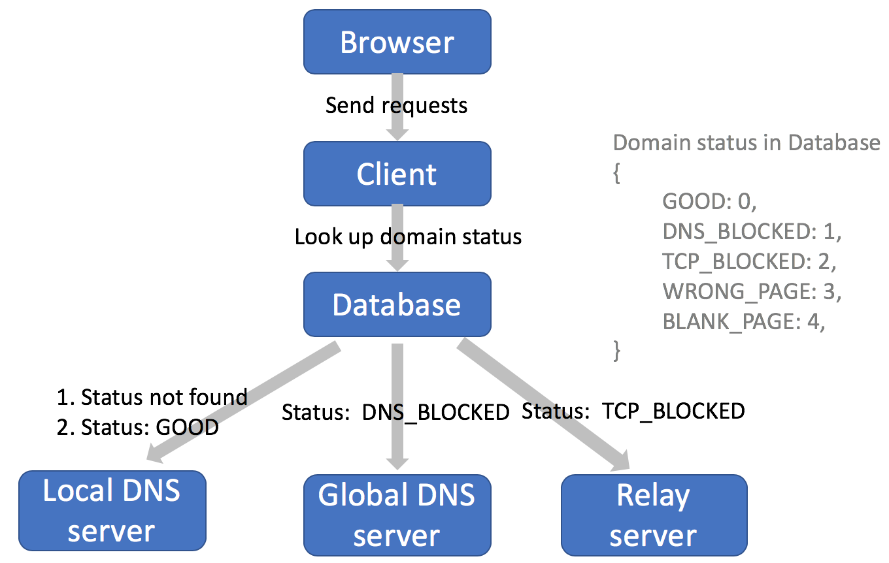
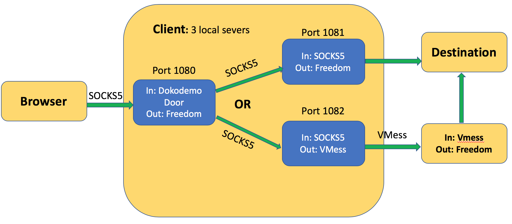

# fensor

*This project is served as a course project for Computer Network.*

"fensor" means "f\*\*\* censor(ship)", it's a tool for circumventing censorship.

This project is based on [v2ray](https://github.com/v2ray/v2ray-core), and the modifications are mainly guided by the paper [Incentivizing censorship measurements via circumvention](https://dl.acm.org/doi/abs/10.1145/3230543.3230568) from SIGCOMM'18.

## Modifications

### On mechanism - adaptive circumvention on the fly 

Every URL will be stored as a tuple `(URL, status)` in a Redis database, fensor will choose different proxy protocol based on the URL status.

| URL status| Circumvention Protocol| 
| ------------- |:-------------:|
| DNS blocked (Finished) | [Freedom](https://v2ray.com/en/configuration/protocols/freedom.html) (modified) |
| TCP conn. blocked/reset (Finished)| [VMess](https://v2ray.com/en/configuration/protocols/vmess.html) |
| Wrong/Blank webpage returned (Under construction) | [VMess](https://v2ray.com/en/configuration/protocols/vmess.html) |

As the figure shows, if the DNS query from the local DNS server fails, fensor will automatically try to resolve through the global DNS query. If the global DNS query fails as well, it will turn to the relay server. Note that the mechanism is fine-grained to URL, each URL can have different status as shown in the figure, thus different strategy may apply.

### On protocols - hybrid mode 

Fensor will launch three different instances of server, 

* Free server: connect remote side directly, using the Freedom protocol, which has been modifed to have the abllity of global DNS query.
* Relay server: connect remote site through a remote server, using the VMess protocol.
* Control server: connect to Free server or Relay server based on the URL status in the database, using the Dokodemo Door protocol.

#### Freedom

When retriving IP address from local DNS servers, if the DNS record is not found, it will mark the domain as `DNS_BLOCKED` in database, and turns to the global DNS servers (e.g., `8.8.8.8`), if there is still no record, mark the domain as `TCP_BLOCKED`.

#### Dokodemo Door

When a request is received, the Dokodemo Door protocol will check the status of the domain in the database, if the status is good, then it will be forwarded to the Free Server (using Freedom protocol); if not, then it will be forwarded to the Relay server (using the VMess protocol).

## Development

### Playground

1. Make sure you have golang installed on your computer, and your `GOPATH` is set properly. Make sure you have installed Redis as well.
2. Pull the code by `go get -u github.com/jiahao42/fensor`
3. Run `fensor/playground/build.sh`, and you shall see two executables: `v2ray` and `v2ctl` under `fensor/playground`. 
4. Run `fensor/playground/run_{protocol}.sh`, fensor will run as both client and server separately on your computer with the default config file (e.g., `hybrid_client.json` and `vmess_server.json`). Check the status of client and server by using `screen -r v2ray`.
5. Set your proxy properly (e.g. in your browser) and you are ready to go. Note that in Firefox, you have to check `Proxy DNS when using SOCKS v5`, as we need to do DNS lookup in fensor instead of browser. 

### Test

To test the whole project, run `go test ./...` under the root directory.
